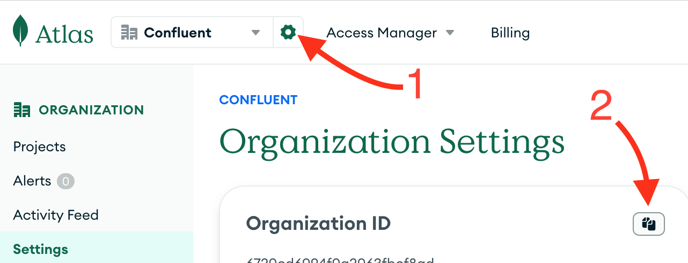

# GenAI Chatbot Quickstart

This quickstart showcases how to use Confluent Cloud with Flink to build a chatbot powered by GenAI. Confluent Cloud enables
real-time data freshness and scalability for the chatbot. 

With Apache Kafka and the [Kora](https://www.confluent.io/kora-cloud-native-apache-kafka-engine/) engine as its foundation, Confluent Cloud
orchestrates the flow of information between various components of the chatbot. 

Flink processes the data in real-time, connects with AI models
and provides the chatbot with the necessary information to respond to user queries.

## Requirements

### Docker

The `deploy`script builds everything for you, the only required software is Docker. 

Follow the [Get Docker](https://docs.docker.com/get-docker/) instructions to install it on your computer.   

### Access Keys to Cloud Services Providers

Once you have `docker` installed, you just need to get keys to authenticate to the various CSPs.  

- [ ] [Confluent Cloud API Keys](https://www.confluent.io/blog/confluent-terraform-provider-intro/#api-key)
- [ ] MongoDB Atlas API key: follow [Grant Programmatic Access to an Organization](https://www.mongodb.com/docs/atlas/configure-api-access/#grant-programmatic-access-to-an-organization) or  [MongoDB Atlas API Keys](https://www.mongodb.com/developer/products/atlas/mongodb-atlas-with-terraform/) (part of a tutorial on Terraform with Atlas)
- [ ] [AWS API Keys](https://docs.aws.amazon.com/general/latest/gr/aws-sec-cred-types.html)

At the end of these steps, you should have:
- A *key* and a *secret* for Confluent Cloud
- A *public key* and a *private key* for MongoDB Atlas
- A *key*, a *secret* and a *token* for AWS.

At last, get your Atlas Organization ID from the Atlas UI.



## Run the Quickstart

### 1. Bring up the infrastructure

```sh
# Follow the prompts to enter your API keys
./deploy.sh
```

### 2. Bring down the infrastructure

```sh
./destroy.sh
```

## 🚀 Project Structure

```text
. # root of the project
├── frontend # Frontend project for the chatbot. This is what will be deployed to s3 and exposed via cloudfront
└── infrastructure # terraform to deploy the infrastructure
    ├── modules
    │     ├── backend # websocket backend & lambdas for the chatbot
    │     │     └── functions # lambda functions
    │     ├── confluent-cloud-cluster # confluent cloud infra. i.e. kafka, flink, schema registry, etc.
    │     └── frontend # s3 bucket and cloudfront distribution
    │         └── scripts # scripts to assist with building and deploying the frontend
    ├── scripts # scripts to assist with deploying the infrastructure
    └── statements # sql statements to register against a flink cluster
        ├── create-models
        ├── create-tables
        └── insert
```
