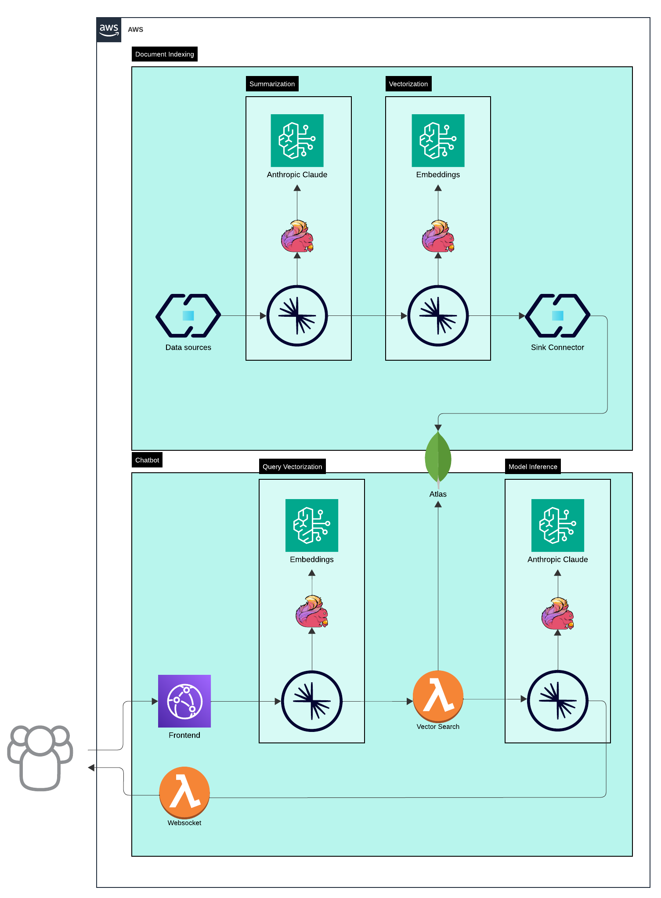
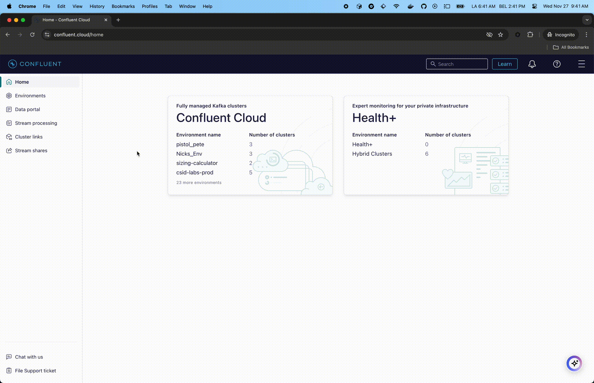
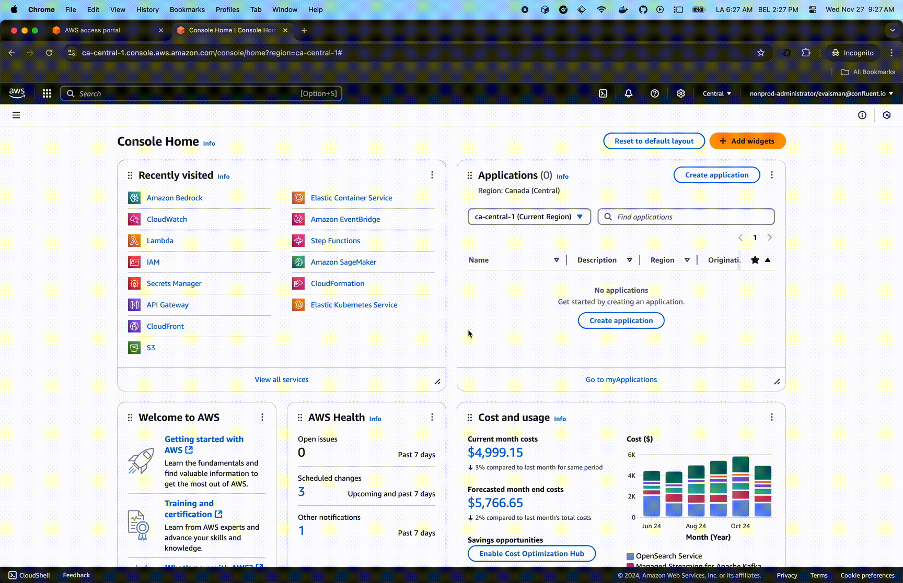

# GenAI Chatbot Quickstart

Welcome to the Small Business Loan Agent Chatbot Quick Start! This repository provides a comprehensive guide to quickly deploy a fully functional chatbot for small business loan assistance. The solution leverages **MongoDB**, **Confluent Cloud**, **AWS**, **Anthropic** and **Flink** to deliver a scalable, intelligent, and real-time conversational experience.

This quick start is designed to help businesses streamline their loan application process by providing a chatbot that understands and answers customer queries, retrieves relevant loan documents, and provides actionable insights. The system also includes structured document indexing into MongoDB's vector database, enabling efficient retrieval-augmented generation (RAG) to enhance the chatbot's response accuracy.

## Key Features

* **Real-Time Data Processing**: Powered by Confluent Cloud and Flink, ensuring low-latency communication and event-driven architecture.
* **Intelligent Conversations**: Integrated with Anthropic's AI models for natural and accurate conversational responses.
* **Efficient Document Retrieval**: Leverages MongoDB Atlas with vector search capabilities for quick and accurate document indexing and retrieval.
* **Scalable and Cloud-Native**: Built with AWS Lambda for a flexible and serverless REST API.
* **Seamless Deployment**: Follow step-by-step instructions to deploy the entire solution with minimal effort.

## Use Case

This chatbot is tailored for small business loan agents to:

* Provide instant responses to loan-related queries.
* Retrieve structured documents and relevant loan information in real-time.
* Automate repetitive tasks, enabling agents to focus on high-value interactions.

Whether you're exploring new ways to enhance customer engagement or testing generative AI use cases in financial services, this quick start provides the perfect foundation.

## Table of Contents

- [GenAI Chatbot Quickstart](#genai-chatbot-quickstart)
  - [Key Features](#key-features)
  - [Use Case](#use-case)
  - [Table of Contents](#table-of-contents)
  - [Architecture](#architecture)
    - [Document Indexing](#document-indexing)
    - [Chatbot](#chatbot)
    - [Key Concepts](#key-concepts)
  - [Requirements](#requirements)
    - [Docker](#docker)
    - [Access Keys to Cloud Services Providers](#access-keys-to-cloud-services-providers)
      - [Confluent Cloud](#confluent-cloud)
      - [MongoDB Atlas](#mongodb-atlas)
      - [AWS](#aws)
        - [Enable Foundation Model Access](#enable-foundation-model-access)
        - [AWS API Keys](#aws-api-keys)
          - [Managed Policies](#managed-policies)
          - [Fine-tuned Policies](#fine-tuned-policies)
  - [Run the Quickstart](#run-the-quickstart)
    - [1. Bring up the infrastructure](#1-bring-up-the-infrastructure)
    - [2. Bring down the infrastructure](#2-bring-down-the-infrastructure)

## Architecture



Architecture for handling document indexing and chatbot functionality using a combination of AWS services, Anthropic
Claude, MongoDB Atlas and Confluent Cloud. Below is a breakdown of the architecture and its components:

### Document Indexing

This section focuses on ingesting and processing data for use in downstream applications like search and chatbots.

1. **Data Sources:** Various data sources feed into the system. These could be structured or unstructured data streams.
2. **Summarization:** Anthropic Claude is used to summarize data to extract meaningful information from documents.
3. **Vectorization:** Embeddings are generated for the input data to convert textual information into high-dimensional numerical vectors.
4. **Sink Connector:** Processed data (both summarized content and embeddings) is output via a sink connector to MongoDB Atlas vector database.

### Chatbot

This section demonstrates how the system interacts with user queries in real time.

1. **Frontend:** The frontend handles interactions with users. User inputs are sent to a topic for further processing.
2. **Websocket:** Provides real-time communication between the frontend and backend for immediate responses.
3. **Query Vectorization:** User queries are vectorized using the Embeddings model to transform them into numerical representations. This is done to match queries against stored vectors in the vector search database.
4. **Vector Search:** MongoDB Atlas vector database, retrieves relevant information based on the vectorized query. It searches through embeddings generated during the document indexing phase.
5. **Model Inference:** Anthropic Claude is used for model inference to generate responses.
6. **Output to User:** The system sends the processed results back to the user via the websocket.

### Key Concepts

1. **Embeddings:** These are vector representations of text, allowing the system to handle semantic search.

2. **MongoDB Atlas:** Enables efficient, scalable, and real-time semantic matching of user queries against high-dimensional embeddings to deliver relevant results in the chatbot and document indexing workflows.

3. **Anthropic Claude:** Used for both summarization and generating responses in natural language.

## Requirements

### Docker

The `deploy`script builds everything for you, the only required software is Docker.

Follow the [Get Docker](https://docs.docker.com/get-docker/) instructions to install it on your computer.

### Access Keys to Cloud Services Providers

Once you have `docker` installed, you just need to get keys to authenticate to the various CSPs.

#### Confluent Cloud



For Confluent Cloud, you need to get a *Cloud resource management* key.

If you don't already have an account, after signing up, click the top right corner menu (AKA the hamburger menu) and select *API keys*.


Click the *+ Add API key* button, select *My Account* and click the *Next* button (bottom right).
If you feel like it, enter a name and description. Click the *Create API Key* (bottom right).

#### MongoDB Atlas


1. Connect to the Atlas UI. You must have Organization Owner access to Atlas.
2. Select *Organization Access* from the *Access Manager* menu in the navigation bar.
3. Click *Access Manager* in the sidebar. (The Organization Access Manager page displays.)
4. Click *Add new* then *API Key*
5. In the *API Key Information*, enter a description.
6. In the *Organization Permissions* menu, select the *Organization Owner* role. **Important:** Make sure that only the
   *Organization Owner* role is selected, you may have to click the default *Organization Member* to un-select it.
7. Click *Next*, copy the public and private key in a safe place and click *Done*.

Useful links:

* [Grant Programmatic Access to an Organization](https://www.mongodb.com/docs/atlas/configure-api-access/#grant-programmatic-access-to-an-organization)
* [MongoDB Atlas API Keys](https://www.mongodb.com/developer/products/atlas/mongodb-atlas-with-terraform/) (part of a tutorial on Terraform with Atlas)

At last, get your Atlas Organization ID from the Atlas UI.


#### AWS

##### Enable Foundation Model Access

Enable access to `amazon.titan-embed-text-v2:0` and `anthropic.claude-3-haiku-20240307-v1:0` models via the AWS Console.



##### AWS API Keys

AWS credentials are required for Flink AI to connect to Bedrock, as well as using terraform to deploy resources. You will need a key and secret with appropriate IAM rights.

###### Managed Policies

If you are using managed policies, Attach the following managed policies to your IAM user or role:

* `AmazonAPIGatewayAdministrator` - Manages and creates the websocket gateway.
* `CloudFrontFullAccess` - Exposes the front end via CloudFront.
* `IAMFullAccess` - Manages roles and policies for Lambda functions.
* `AWSLambda_FullAccess` - Manages Lambda functions.
* `CloudWatchFullAccess` - Manages logs and metrics.
* `AmazonS3FullAccess` - Manages the S3 bucket for the front end and other Lambda resources.
* `SecretsManagerReadWrite` - Manages secrets for Lambda functions.
* `AmazonBedrockStudioPermissionsBoundary` - Invokes Bedrock foundational models.

###### Fine-tuned Policies

For more granular permissions, refer to our [cloudtrail events](./assets/quickstart-iam-policy-cloudtrail.csv) for the exact resources and actions required.

**Useful links:**

* [AWS API Keys](https://docs.aws.amazon.com/general/latest/gr/aws-sec-cred-types.html)
* [Bedrock policies](https://docs.aws.amazon.com/bedrock/latest/userguide/security-iam-awsmanpol.html)
* [Lambda policies](https://docs.aws.amazon.com/lambda/latest/dg/permissions-user-function.html)
* [Flink AI: Create Model](https://docs.confluent.io/cloud/current/ai/ai-model-inference.html#create-an-ai-model)
* [Bedrock from Flink AI](https://docs.confluent.io/cloud/current/ai/ai-model-inference.html#aws-bedrock)

## Run the Quickstart

### 1. Bring up the infrastructure

```sh
# Follow the prompts to enter your API keys
./deploy.sh
```

### 2. Bring down the infrastructure

```sh
./destroy.sh
